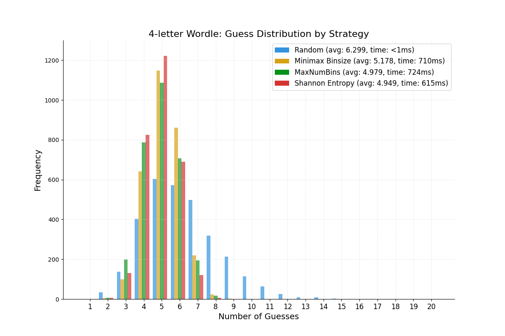
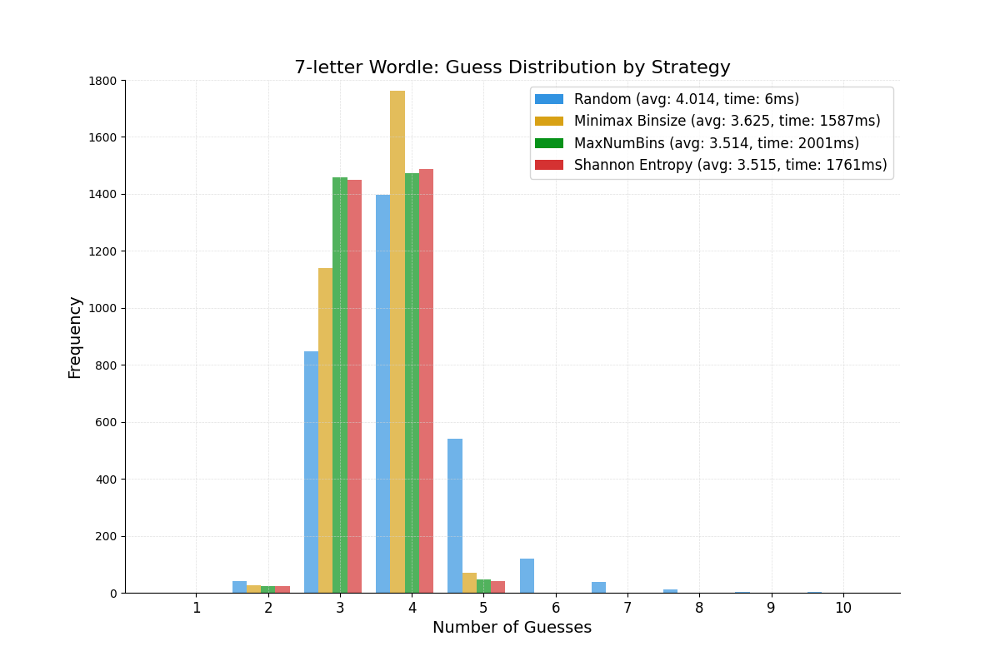
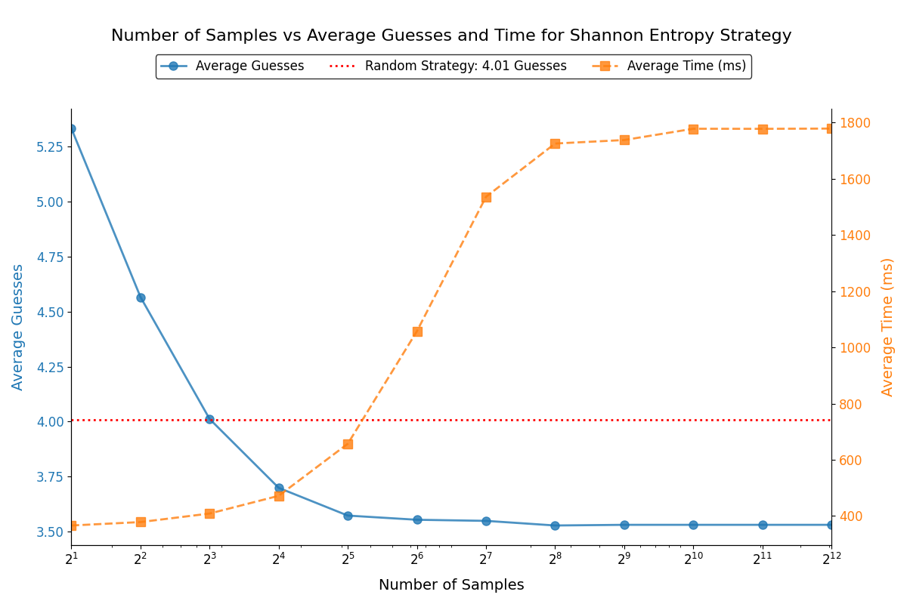

# A Comparative Study of Heuristic Strategies for Solving the Wordle Puzzle

## 📌 Overview
This is an investigation into the computational cost and effectiveness of random and heuristic strategies in solving 4- and 7-letter Wordle puzzles. The Wordle puzzle, a popular word-guessing game, requires players to identify a target word within a limited number of guesses, using feedback on letter accuracy and position. The investigation aims to compare the performance of random guessing approaches against heuristic strategies, which leverage feedback to optimize subsequent guesses, in terms of efficiency (number of guesses required) and computational cost (processing time).

## 🔍 Research Question
To what extent do random and heuristic strategies differ in computational cost and effectiveness when solving 4- and 7-letter Wordle puzzles?

## 📃 Methodology (check scripts/strategies.cpp)
The study implements two primary strategies:
1. **Random Strategy**: Selects guesses randomly from a predefined word list without utilizing feedback from previous guesses.
2. **Heuristic Strategy**: Employs an algorithm that uses feedback (correct letters, correct positions, and incorrect letters) to narrow down the pool of possible words, prioritizing guesses based on letter frequency and positional likelihood. These heuristics are:
   - **Minimax Binsize**: Minimizes the size of the largest bin produced from guessing a word; a bin is the set of words that may be the answer after receiving a certain string of feedback colors from guessing a certain word. I.e., there are $3^k$ bins for a length-k guess.
   - **MaxNumBins**: Maximizes the number of non-empty bins produced from guessing a word.
   - **Shannon Entropy**: Maximizes the information entropy of the bins such that the word with the highest amount of information gained about the answer is selected.
3. **Entropy with Random Sampling**: Identical to the Shannon Entropy strategy except that only a randomly-sampled subset (of some size) of words are used to determine the bins and calculate the information entropy. This should work for subset sizes of ~100 due to the Law of Large Numbers, which states that results produced by a sufficiently large sample converges to the results produced by the entire population.

The experiment was conducted using Python to simulate Wordle games for both 4-letter and 7-letter word lengths. A dataset of valid English words was curated for each word length. The random strategy served as a baseline, while the heuristic approach incorporated a scoring mechanism to rank potential guesses. Key metrics measured include:
- **Effectiveness**: Average number of guesses required to solve the puzzle.
- **Computational Cost**: Execution time per puzzle, measured in milliseconds.

Simulations were run over 3,000 trials for each strategy (except entropy with random sampling, which ran 12 sample sizes x 1,000 random words for each size = 12,000 trials) and word length to ensure statistical reliability. The target words were randomly selected from the respective word lists, and performance was evaluated under consistent conditions.

## 📊 Findings (CPU: 13th Gen Intel(R) Core(TM) i7-13700K)
The results demonstrate significant differences between the two strategies:
- **Effectiveness**: The heuristic strategies consistently outperformed the random strategy, requiring fewer guesses on average for both 4-letter (~5 vs. 6.3 guesses) and 7-letter (~3.5 vs. 4 guesses) puzzles. These heuristic approaches benefited from feedback-driven optimization, reducing the search space effectively.
- **Computational Cost**: The random strategy exhibited lower computational cost (1-6 ms per puzzle) compared to the heuristic strategies (average ~700 ms for 4-letter and ~2000 ms for 7-letter puzzles) due to its simplicity. However, the heuristic strategy’s increased computational cost was justified by its superior effectiveness, particularly for smaller word lengths where random guesses are likely unable to narrow down the search space by much.
- **Word Length Impact**: The performance gap between strategies decreased for 7-letter puzzles, as heuristics were able to select words with cut the search space more compared to the random strategy for 4 letters, while these benefits decreased for longer word lengths as every word has, on average, more distinct letters. Refer to *Figure 1* and *Figure 2*.
- **Optimizing Runtime and Guess Counts**: Seen by the entropy with random sampling strategy, the Law of Large Numbers holds true in this scenario, which allows the runtime complexity to be cut dramatically due to needing to iterate through smaller samples while still maintaining competitive guess counts. Refer to *Figure 3*.

### 📈 Figures

<div style="text-align: center;"> *Figure 1. Guess distribution curve of different strategies for 4-letter words* </div> 

<div style="text-align: center;"> *Figure 2. Guess distribution curve of different strategies for 7-letter words* </div>

<div style="text-align: center;"> *Figure 3. Execution time and guess counts for the entropy with random sampling strategy with different sample sizes for 7-letter words* </div>

## ⚙️ Implications and Applications
This study highlights the importance of heuristic optimization in algorithmic problem-solving, with potential applications in game-solving AI, natural language processing, and other constraint-satisfaction problems. The insights gained here may inform the design of algorithms for similar puzzles or real-world scenarios requiring decision-making without full information.

## 🎓 Future Work
- **Parallelization**: Creating the bins from testing words can be parallelized which reduces execution time depending on the number of cores of the machine.
- **Tree-based Strategy**: Consider building a precomputed decision tree which uses results from one of the heuristic strategies, with nodes as guesses and branches as feedback color combinations. This allows quick traversal of the tree when obtaining feedback to minimize execution time. However, precomputation is costly and incurs a further memory requirement of storing the tree.
- **Testing More Datasets**: The English dictionary has words such that there are very few anagrams and repeating letters in words. However, against more adversarial datasets, such as those with many anagrams and/or repeating letters, the results may differ.

## 🚀 Build and Run
1. Make a copy of this repo
2. Navigate to the scripts directory:
   ```bash
   cd scripts
   ```
3. Compile and run the testing scripts
   ```bash
   g++ fourandseventesting.cpp -o fourandseventesting.exe
   ```
   then
   ```bash
   ./fourandseventesting.exe
   ```
   or 
   ```bash
   g++ hybridtesting.cpp -o hybridtesting.exe
   ```
   then
   ```bash
   ./hybridtesting.exe
   ```

### Dependencies
#### System Requirements
- Windows/Linux/macOS

#### Environment Requirements
- Python 3.12+
- NumPy package
- Matplotlib package
- GCC 12+ (`-std=c++23`)
- CMake 3.15+ (optional, for building from source)

## 📖 References and Resources
- Greenberg, R.I. (2024). Effective Wordle Heuristics. [arXiv preprint arXiv:2408.11730](https://arxiv.org/pdf/2408.11730).
- Jonathanwelton. (2022). GitHub - jonathanwelton/word-lists: A collection of n-letter word lists in json format. GitHub. https://github.com/jonathanwelton/word-lists
- Lahiri, A. et al. (2023). Deterministic Algorithmic Approaches to Solve Generalised Wordle. [arXiv preprint arXiv:2305.14756](https://arxiv.org/pdf/2305.14756).
- Unzueta, D. (2025). Information Theory applied to Wordle. Towards Data Science. https://towardsdatascience.com/information-theory-applied-to-wordle-b63b34a6538e/